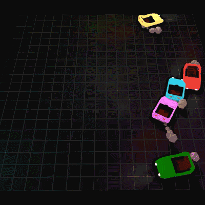

# Bumper Cars
Final individual project for *COMP 371 - Computer Graphics (Fall 2019)* implemented with OpenGL and C++.

This project simulates the behaviors of multiple bumper cars within an area.

[Video demo](https://youtu.be/FRxqNq7UKvc)

### Main Features
- Custom assets (car and smoke) modeled in Blender.
- Smoke simulation from the exhaust.
- Collision detection between cars and boundaries.
- Multiple lighting; headlights and taillights for the cars; multiple scene lights.
- Shadows.
- Random car positioning, behaviors, and colors on startup.

### Keys
###### *Camera controls are very similar to Minecraft's creative mode camera controls.*
 - **W**: Move camera forward
 - **A**: Move camera left
 - **S**: Move camera back
 - **D**: Move camera right
 - **Left Shift**: Move camera down
 - **Space**: Move camera up
 - **Left Control**: Increase camera speed
 - **Mouse Hold + Drag Up**: Zoom in
 - **Mouse Hold + Drag Down**: Zoom out
 - **Mouse Move**: Look direction
 - **Home**: Reset camera view
 - **C**: Change to first person camera
 - **H**: Stop car simulation
 - **L**: Toggle car lights
 - **ESC**: Exit application

#### Credits
- [Learn OpenGL](https://learnopengl.com/)
- [OpenGL Tutorial](https://www.opengl-tutorial.org/)
- COMP 371 labs code
